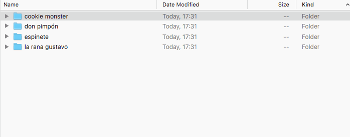
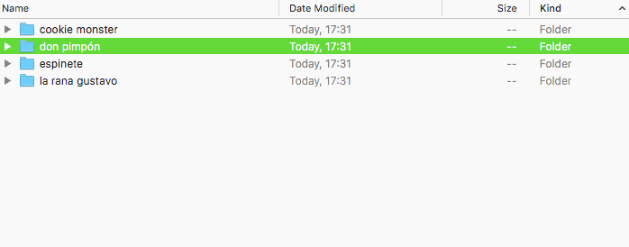
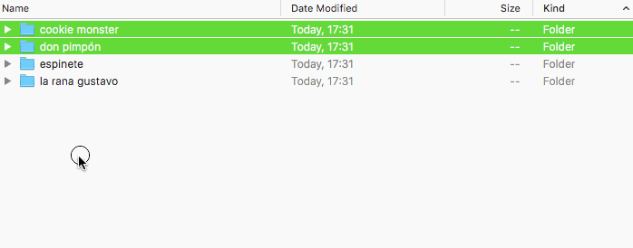
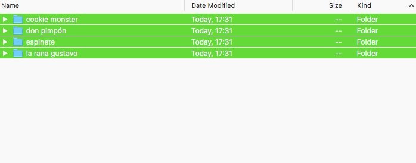
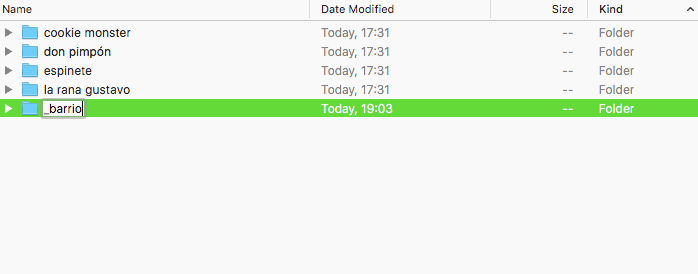
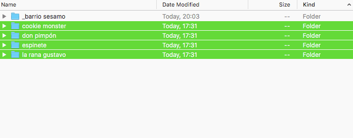

# Selección de elementos

En la [clase anterior](101-gestion-del-file-system-con-atajos-de-teclado) hemos visto como crear nuevas carpetas, y como borrarlas.

Qué tal si quisíeramos borrár más carpetas a la vez? Tendriamos que darle al <kbd>Del</kbd> por cada elemento? Qué rollo no?
Por suerte, el sistema operativo nos propina varias opciones para que la tarea sea mas simple.

## Selecciónes contiguas: <kbd>Shift</kbd> + <kbd>↑/↓</kbd>

La tecla <kbd>Shift</kbd>(<kbd>⇧</kbd>) es nuestro primero aliado. Situemonos en una carpeta con varias carpetas en su interior (consejo: hacerlo como ejercicio!), seleccionár el primer elemento y, **manteniendo apretado <kbd>Shift</kbd>**, apretar la flecha hacia abajo (<kbd>↓</kbd>): las dos primeras carpetas seran seleccionadas!

Si pulsamos una vez mas, la selección se extenderá a la tercera carpeta, y así hasta el final.

_Shift + flecha arriba/abajo extiende o reduce la selección corriente._

Si ahora le damos al <kbd>Delete</kbd>, puff! todas las carpetas nos saludarán.  
En cambio, <kbd>Shift</kbd>+<kbd>↑</kbd> restringe la selección corriente: probar para ver.

---

**Nota:** <kbd>Shift</kbd>+<kbd>↑/↓</kbd> mantiene fijo el indice iniciál de la selección. Es decír, si en una lista de 4 carpetas seleccionamos primero la segunda y alteramos la selección, de ninguna forma podremos incluir el primer elemento!

_Una imagen vale mas de mil palabras._

Solucion? Seleccionar desde el elemento que nos interese : ))

## Seleccionar todo: <kbd>Ctrl</kbd>+<kbd>A</kbd>

Antes de seguir con ulteriores metodos de selección, no se nos olvide uno de los mas utiles: seleccionar todo!

Es muy simple: situados en una carpeta, <kbd>Ctrl</kbd>+<kbd>A</kbd> selecciona todo su contenido. Ojo al manipular _todos_ los elementos de una carpeta, hacerlo solo si es vuestra real intención!

## Alterar selecciones existentes: <kbd>Ctrl</kbd>+Click

A veces los elementos que nos interesan no aparecen de forma consecutiva en el interior de una carpeta, así que la tecnica recién aprendida no es efectiva. A caso esto significa que debemos volver a tratar los elementos uno a uno? No por supuesto, ahora veremos como.

Tenemos que seleccionar los elementos 1, 2 y 4 de nuestra lista: antes seleccionamos los primeros dos con la tecnica del <kbd>Shift</kbd>+<kbd>↑/↓</kbd>, y luego apretamos <kbd>Ctrl</kbd> y hacemos click en el ultimo elemento: et voilá!

_Ctrl + Click sobre el elemento deseado, añade el mismo a la seleccíon corriente._

Que tal si queremos _quitar_ algo de una selección? Se sigue el mismo patrón!

_Ctrl + Click quita elementos también._

**Nota:** como todo instrumento, no hay una forma unica de obtener un resultado. Tal vez resulta mas simple seleccionar todo y quitar lo que sobra, otra vez es mas comodo empezar una selección contigua y añadir los elementos necesarios después; la practica ayudará a conocer la manera mas comoda para cadauno.

## Mover y copiar archivos existentes: <kbd>Ctrl</kbd>+<kbd>C</kbd>/<kbd>Ctrl</kbd>+<kbd>X</kbd> -> <kbd>Ctrl</kbd>+<kbd>V</kbd>

Hasta ahora nos hemos limitado a borrar elementos. Normalmente no es necesario ser tan destructivos, y puede ser util mover los mismos en diferentes lugares.

Como hacerlo? Una vez seleccionados los elementos que nos interesan (a través de las tecnicas anteriores):

- darle al <kbd>Ctrl</kbd>+<kbd>X</kbd> (_cortar_) (vease como los elementos son semitrasparentes ahora);
- situarse el la carpeta de destinación;
- darle al <kbd>Ctrl</kbd>+<kbd>V</kbd> (_pegar_).

_Ctrl+X / Ctrl+V: porqué perder tiempo con el ratón?_

En el caso qué nos interese copiar los elementos en vez de moverlos, utilizar <kbd>Ctrl</kbd>+<kbd>C</kbd> (_copiar_) en lugar de <kbd>Ctrl</kbd>+<kbd>C</kbd>.

_Ctrl+C / Ctrl+V duplica los elementos seleccionados._

**Nota:** la operación de cortar, sin sucesivo pegar, _no es destructiva_. Es decir, si os olvidais de pegar, los archivos se quedan en su lugar.
